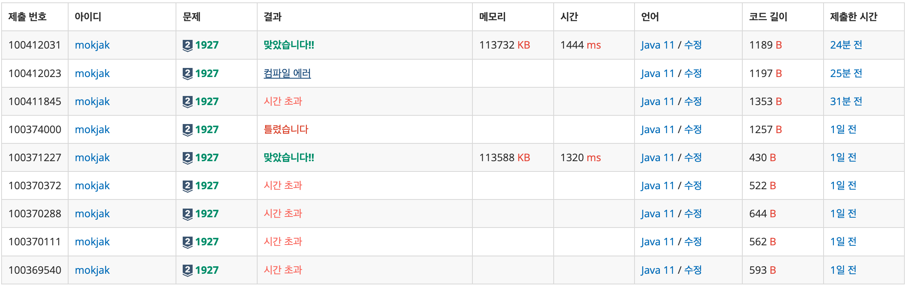
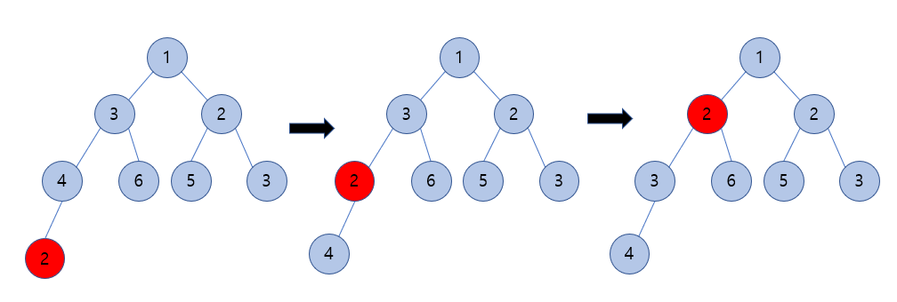
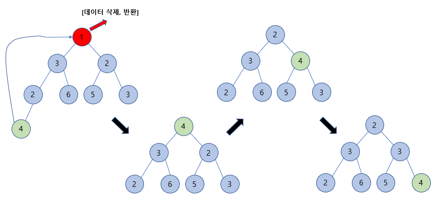

## 📝 문제 요약

> 정수 x가 주어질 때,

- x ≠ 0 → 배열에 x 삽입
- x = 0 → 배열에서 가장 작은 값을 출력하고 제거 (배열이 비어있으면 0 출력)
  >

→ 이를 O(log N) 이하의 시간 복잡도로 처리해야 함.

---

## 💡 1. 나의 접근 방식 & 핵심 아이디어

- **알고리즘/자료구조:**
  - 처음엔 배열/ArrayList 기반 구현으로 최소값 찾기 → **O(N)** → 시간초과
    ⇒ 정렬 기반 구현 → **O(NlogN)** → 시간초과
    ⇒ Java PriorityQueue 사용 → 통과
    ⇒ **직접 최소 힙(Min-Heap) 구현** → 통과
- **시간/공간 복잡도:**
  - insert: **O(logN)**
  - pop: **P(logN)**
  - 공간복잡도
    - 힙배열 공간: O(N)
- **핵심 로직:**
  1. **삽입(insert)**
     - 배열 마지막에 값 추가
     - 부모와 비교하며 위로 올리는 방식(shift-up)
  2. **삭제(pop)**
     - 루트(최솟값)를 반환
     - 마지막 원소를 루트에 올리고, 두 자식 중 더 작은 자식과 비교하며 아래로 이동(shift-down)
  3. **시간 초과의 핵심 원인**
     - ArrayList, 반복 정렬 등 **탐색 비용**

---

## ✨ 2. 나의 최종 코드

- 코드 보기

  ```jsx
  import java.util.*;

  public class BAEK_S2_1927 {
      static int N, last;
      static int[] minHeap;

      public static void main(String[] args) {
          Scanner sc = new Scanner(System.in);

          N = sc.nextInt();
          minHeap = new int[N + 1];
          for (int time = 0; time < N; time++) {
              int x = sc.nextInt();
              if (x == 0) {
                  System.out.println(pop());
              } else {
                  insert(x);
              }
          }
      }

      public static void insert(int x) {
          minHeap[++last] = x;
          int target = last;
          while (target / 2 > 0 && minHeap[target / 2] > x) {
              int parent = minHeap[target / 2];
              minHeap[target / 2] = x;
              minHeap[target] = parent;
              target /= 2;
          }
      }

      public static int pop() {
          if (last == 0)
              return 0;

          int result = minHeap[1];
          minHeap[1] = minHeap[last--];

          int target = 1;

          while (target * 2 <= last) {
              int left = target * 2;
              int right = target * 2 + 1;
              int childIdx = left;

              if (right <= last && minHeap[right] < minHeap[left]) {
                  childIdx = right;
              }

              if (minHeap[childIdx] < minHeap[target]) {
                  int child = minHeap[childIdx];
                  minHeap[childIdx] = minHeap[target];
                  minHeap[target] = child;
                  target = childIdx;
              } else {
                  break;
              }
          }
          return result;
      }
  }

  ```

---

## 🤔 3. 문제 회고 (Retrospective)

### 🐾 3-1. 오류 해결 과정 (Troubleshooting Log)



- **1차시도 - ArrayList 전체 탐색 → 시간 초과**
  ```jsx
  static ArrayList<Integer> heap = new ArrayList<>();
  ```
  - XOR 연산 착각
    ```jsx
    int min = 2^31;
    ```
  - 매 pop마다 O(N) 순회
- **2회차 - Collections.min 사용 → 시간 초과**
  - 최소값 찾기:
    - `Collections.min(list)` → O(N)
    - `list.indexOf(min)` → O(N)
  - pop 시 최소 **O(2N)**
- **3차시도 - ArrayList + sort → 시간초과**
  - 매 삽입마다 정렬 → **O(NlogN)**
  - N 최대 100,000 → 불가
- **4차시도 - PriorityQueue 사용 → 맞았습니다!!**
  - java의 Priority Queue 사용
    ```jsx
    PriorityQueue<Integer> queue = new PriorityQueue<>();
    ```
- **5~8차시도 - 직접 최소 힙 구현**
  - 배열 기반 힙 구현
  - shift-up / shift-down 구현 과정에서 여러 버그 수정
    - pop 시 while 조건 오류
    - childIdx 초기화 누락
    - 범위 체크 문데
      **⇒ 최종 성공**

### **🌱 3-2. 새롭게 알게 된 점 (Learning Points)**

- **최소 힙의 구조**
  - 완전이진트리 기반이며 부모/자식 인덱스가 규칙적으로 계산됨
  - 삽입과정
    
  - 삭제 과정
    
- **java의 PriorityQueue우선순위 큐 자료구조**
  `PriorityQueue<Integer> queue = new PriorityQueue<>();`
  - 내부적으로 최소 힙으로 구현되어 있으며 O(logN) 보장됨

### 🧐 3-3. 더 궁금한 점 & 다음 목표 (Further Questions)

- 최대 힙(Max Heap)도 직접 구현해보기
- BufferedReader + StringBuilder로 I/O 최적화하기
- 힙을 활용한 응용 문제들 도전
