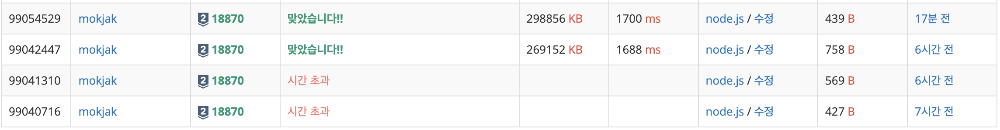

## 📝 문제 요약

> 주어진 수열 각 원소를 순회하며, 값보다 작은 서로 다른 값들의 개수 출력.

---

## 💡 1. 나의 접근 방식 & 핵심 아이디어

- **알고리즘/자료구조:**
  - Set으로 중복 제거 → 오름차순 정렬 → 값 → 압축인덱스 Map 생성 → 원본 순회 치환
- **시간/공간 복잡도:**
  - **시간복잡도**: O(nlogn)
  - **공간복잡도**: O(n)
- **핵심 로직:**
  1. 입력 파싱 후 배열로 반환
  2. Set으로 고유값 추출 후 정렬
  3. 정렬된 고유값에 인덱스 부여(Map)
  4. 원본 배열을 매핑해 순서대로 출력

---

## ✨ 2. 나의 최종 코드

- 코드 보기

  ```jsx
  const fs = require("fs");
  const input = fs.readFileSync("/dev/stdin").toString().trim().split("\n");

  const n = Number(input[0]);
  const arr = input[1].split(" ").map(Number);

  const sortArr = [...new Set(arr)].sort((a, b) => a - b);

  const calculated = new Map();
  for (let i = 0; i < sortArr.length; i++) {
    calculated.set(sortArr[i], i);
  }

  const out = arr.map((v) => calculated.get(v)).join(" ");
  process.stdout.write(out);
  ```

---

## 🤔 3. 문제 회고 (Retrospective)

### 🐾 3-1. 오류 해결 과정 (Troubleshooting Log)



- **1차시도(시간초과)**

  - **방식**: 입력 배열과 이를 중복 제거하여(set으로 전환) 정렬한 배열(sortedArr)를 생성하여 비교
  - **문제**: 중첩 순회로 비효율

  ```jsx
  let message = "";
  arr.forEach((num) => {
    let i = 0;
    for (i; i < sortedArr.length; i++) {
      if (sortedArr[i] >= num) break;
    }
    message += i + " ";
  });
  ```

- **2차시도(시간초과)**

  - **개선**: 이전 값 결과 Map에 기록
  - **한계**: 여전히 중첩 O(n \* U)

  ```jsx
  const visited = new Map();

  let message = "";
  arr.forEach((num) => {
    if (visited.has(num)) {
      message += visited.get(num) + " ";
    } else {
      let i = 0;
      for (i; i < sortedArr.length; i++) {
        if (sortedArr[i] >= num) break;
      }
      visited.set(num, i);
      message += i + " ";
    }
  });
  ```

- **3차시도(맞았습니다!)**

  - **개선**: 정렬된 전체 배열 + 중복 건너뛰며 계산

  ```jsx
  const calculateNum = () => {
    let lastNum = -Infinity;
    let currNum = -Infinity;
    for (let i = 0; i < n; i++) {
      currNum = sortedArr[i];
      if (i !== 0 && lastNum === currNum) continue;
      if (lastNum !== -Infinity) {
        calculated.set(currNum, calculated.get(lastNum) + 1);
      } else {
        calculated.set(currNum, 0);
      }
      lastNum = currNum;
    }
  };

  calculateNum();
  ```

- **4차시도(리팩토링)**

  - **개선**

    1. n을 Number()로 명시적 변환
    2. Set 변환으로 중복 제거 후 정렬 → 비교 연산 감소 (여기서 시간이 많이 걸린 것이 아니었음..!)
    3. claculated 단순화 (인덱스 자체를 압축값으로 사용)
    4. 문자열 누적 → join 방식

    ```
    const n = Number(input[0]);
    const arr = input[1].split(" ").map(Number);

    const sortArr = [...new Set(arr)].sort((a, b) => a - b);

    const calculated = new Map();
    for (let i = 0; i < sortArr.length; i++) {
      calculated.set(sortArr[i], i);
    }

    const out = arr.map((v) => calculated.get(v)).join(" ");
    ```

### **🌱 3-2. 새롭게 알게 된 점 (Learning Points)**

- 중복 제거(Set) 후 정렬이 직접 선형 스캔보다 단순하고 안전하다
  - 생각보다 Set전환후 재전환 비용이 적음

### 🧐 3-3. 더 궁금한 점 & 다음 목표 (Further Questions)
