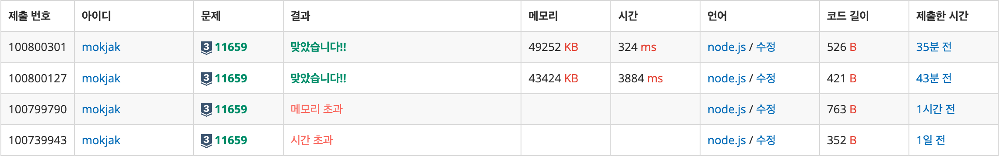

> **📘 핵심**
> “초기에 2차원 배열, Map 방식으로 접근했지만 JS의 참조 비교 매커니즘과 메모리 한계를 파악하여 누적합 알고리즘으로 전환했다. ‘모든 경우를 저장’하는 대신 ‘필요한 정보만 전처리’하는 **사고 전환**을 통해 **O(N^2) → O(N) 최적화**, **I/O 패턴 개선**까지 적용해 **최적화했다**.

---

## 📝 문제 요약

> **N**개의 수가 주어졌을 때, **M**개의 구간 `[i, j]`에 대한 합을 빠르게 구하는 문제.
> 핵심: 누적합(`Prefix Sum`)을 전처리하여 각 쿼리를 `O(1)`에 처리

---

## 💡 1. 나의 접근 방식 & 핵심 아이디어

- **알고리즘/자료구조:**
  - 누적합 배열 (Prefix Sum Array)
  - 1차원 배열로 구간 합 전처리
- **시간/공간 복잡도:**
  - 시간: `O(N+M)` (누적합 계산 O(N) + 쿼리 처리 O(M))
  - 공간: `O(N)` (누적합 배열)
- **핵심 로직:**
  1. `prefixSum[i]` = `arr[0]` 부터 `arr[i-1]`까지의 합
  2. 구간 [s, e]의 합 = `prefixSum[e]  - prefixSum[s-1]`
  3. 모든 결과를 배열에 모아 한 번에 출력 (I/O 최적화)

---

## ✨ 2. 나의 최종 코드

- 코드 보기
  ```jsx
  const fs = require("fs");
  const input = fs.readFileSync("/dev/stdin").toString().trim().split("\n");

  const [N, M] = input[0].split(" ").map(Number);
  const arr = input[1].split(" ").map(Number);
  const prefixSum = new Array(N + 1).fill(0);

  for (let i = 0; i < N; i++) {
    prefixSum[i + 1] = prefixSum[i] + arr[i];
  }

  const result = [];
  for (let t = 0; t < M; t++) {
    const [s, e] = input[2 + t].split(" ").map(Number);
    result.push(prefixSum[e] - prefixSum[s - 1]);
  }
  console.log(result.join("\n"));
  ```

---

## 🤔 3. 문제 회고 (Retrospective)

### 🐾 3-1. 오류 해결 과정 (Troubleshooting Log)



- **1차시도(시간초과)**
  - 특별 알고리즘 없이, for문으로 그대로 구현
- **2차시도(메모리초과)**

  - 아이디어: “i→j의 합 = i→j-1의 합 + arr[j]” (DP 점화식)
  - 시도한 방법: 2차원 배열

  ```jsx
  const sumMap = new Array(N + 1);
  for (let i = 1; i < N + 1; i++) {
    sumMap[i] = new Array(N + 1).map(Number);
  }

  for (let i = 1; i < N + 1; i++) {
    sumMap[i][i] = arr[i - 1];
  }

  for (let i = 1; i < N + 1; i++) {
    for (let j = i + 1; j < N + 1; j++) {
      sumMap[i][j] = sumMap[i][j - 1] + sumMap[j][j];
    }
  }
  ```

- **3차시도(맞았습니다!!)**

  - 개선: 누적합 적용

  ```jsx
  for (let i = 0; i < N; i++) {
    sum[i + 1] = sum[i] + arr[i];
  }

  for (let t = 0; t < M; t++) {
    const [s, e] = input[2 + t].split(" ").map(Number);
    console.log(sum[e] - sum[s - 1]);
  }
  ```

- **4차시도(맞았습니다!!) - 리팩토링**

  - 변수 명 변경: `sum` → `prefixSum`
  - I/O 오버헤드 → 시간 `3884ms → 324ms`

  ```jsx
  const result = [];
  for (let t = 0; t < M; t++) {
    const [s, e] = input[2 + t].split(" ").map(Number);
    result.push(prefixSum[e] - prefixSum[s - 1]);
  }
  console.log(result.join("\n"));
  ```

- **시간복잡도 비교**
  | 접근           | 전처리 | 쿼리 | 전체     | 공간   |
  | -------------- | ------ | ---- | -------- | ------ |
  | 매번 계산      | O(1)   | O(N) | O(NM)    | O(1)   |
  | 모든 구간 저장 | O(N^2) | O(1) | O(N^2+M) | O(N^2) |
  | 누적합         | O(N)   | O(1) | O(N+M)   | O(N)   |

### **🌱 3-2. 새롭게 알게 된 점 (Learning Points)**

- **누적합(Prefix Sum) 알고리즘**
  - 정의: `prefixSum[i]` = 처음부터 i번째까지의 누적 합
  - 구간 합: `[L, R] = prefixSum[R] - prefixSum[L-1]`
  - 인덱스 처리: 0-based 배열에서 1-based 쿼리 처리 주의
  ```jsx
  prefixSum[0] = 0; // 더미 값으로 L=1일 때 처리 간편화
  ```
- **Map의 키 비교 매커니즘**
  - 객체/배열을 키로 사용 시 **참조 비교**
    ```jsx
    const map = new map();
    map.set({ a: 1 }, "value");
    map.get({ a: 1 }); // undefined (다른 객체)

    // 해결책 1: 문자열 키
    map.set("1,3", value);
    map.get("1,3"); // OK

    // 해결책 2: 같은 객체 재사용
    const key = { a: 1 };
    map.set(key, value);
    map.get(key); // OK
    ```
- **I/O 최적화 패턴**
  - 반복 출력보다 배열 모아서 한 번에 출력
  ```jsx
  // 느림
  for (let i = 0; i < M; i++) {
    console.log(result[i]);
  }

  // 빠름
  console.log(result.join("\n"));
  ```
- **Array 생성자**
  ```jsx
  // 방법 1: fill
  const arr = new Array(N + 1).fill(0);

  // 방법 2: Array.from
  const arr = Array.from({ length: N + 1 }, () => 0);

  // 방법 3: spread
  const arr = [...Array(N + 1)].map(() => 0);
  ```

### 🧐 3-3. 더 궁금한 점 & 다음 목표 (Further Questions)

-
