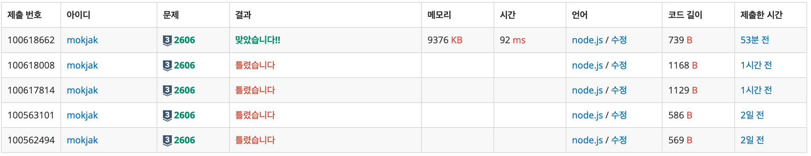

## 📝 문제 요약

> 1번 컴퓨터가 바이러스에 걸렸을 때, 네트워크를 통해 감염되는 컴퓨터의 수를 구하는 문제.
> 핵심: 1번 노드와 연결된 모든 노드 개수 찾기 (연결 요소 크기 - 1)

---

## 💡 1. 나의 접근 방식 & 핵심 아이디어

- **알고리즘/자료구조:**
  - 그룹 번호 할당 + 연결 표시(`network` 배열)
  - 1번과 직접/간접 연결된 그룹만 체크하여 카운트
- **시간/공간 복잡도:**
  - 시간: **O(N+K)** (간선 순회 + 결과 집계)
  - 공간: **O(N)** (`arr`, `network` 배열)
- **핵심 로직:**
  1. 각 컴퓨터에 그룹 번호 할당 (`arr[i]`)
  2. 서로 다른 그룹이 연결되면 두 그룹 모두 `network=true`로 표시
  3. 1번에 속한 그룹(`arr[1]=1`)과 `network[1]=true`인 그룹에 속한 컴퓨터 개수 집계

---

## ✨ 2. 나의 최종 코드

- 코드 보기

  ```jsx
  const fs = require("fs");
  const input = fs.readFileSync("/dev/stdin").toString().trim().split("\n");

  const N = Number(input[0]);
  const K = Number(input[1]);
  const arr = new Array(N + 1).fill(0);
  arr[1] = 1;
  const network = new Array(N + 1).fill(false);
  network[1] = true;
  let group = 1;

  for (let i = 0; i < K; i++) {
    const [a, b] = input[2 + i].split(" ").map(Number);

    if (!arr[a] && !arr[b]) {
      group++;
      arr[a] = group;
      arr[b] = group;
    } else if (!arr[a] || !arr[b]) {
      if (arr[a]) arr[b] = arr[a];
      else arr[a] = arr[b];
    } else if (arr[a] !== arr[b]) {
      network[arr[a]] = true;
      network[arr[b]] = true;
    }
  }

  let result = 0;
  for (let i = 2; i <= N; i++) {
    if (network[arr[i]]) result++;
  }
  console.log(result);
  ```

---

## 🤔 3. 문제 회고 (Retrospective)

### 🐾 3-1. 오류 해결 과정 (Troubleshooting Log)



- **1,2차시도(틀렸습니다)**

  - **접근**: 각 컴퓨터에 그룹 번호 할당
    - 둘 다 미할당 → 새 그룹
    - 한쪽만 할당 → 같은 그룹 편입
  - **문제**: 서로 다른 그룹이 연결될 때 처리 누락
    ```jsx
    // arr[a] !== arr[b] 케이스 미처리
    // 예: 1-2(그룹1), 3-4(그룹2), 2-3 입력 시
    //     arr[2]=1, arr[3]=2로 다르지만 병합/표시 없음
    ```
  - **반례:**
    ```jsx
    입력: 1-2, 3-4, 2-3
    기대: 3개 (2, 3, 4 모두 1과 연결)
    출력: 1개 (arr[1]과 같은 그룹만 카운트)
    ```

- **3,4차시도(틀렸습니다)**

  - **개선**: `network` 배열 도입
    - 의도: “1번과 연결된 그룹” 표시
  - **시도한 로직들:**

    ```jsx
    // 3차: 그룹이 다르면 무조건 표시 (너무 광범위)
    else {
      network[arr[a]] = true;
      network[arr[b]] = true;
    }

    // 4차: a 또는 b가 1번이면 표시 (직접 연결만 감지)
    else if (a === 1 || b === 1) {
      network[arr[a]] = true;
      network[arr[b]] = true;
    }
    ```

  - **문제:**
    - 3차는 1번과 무관한 그룹도 `true` 오염
    - 4차는 간접 연결(1-2, 2-3) 미감지
  - **디버깅 과정:**
    - `console.log`로 각 단계 상태 추적
    - `input.txt` 반례 직접 작성해 실행

- **5차시도(맞았습니다!!)**

  - **핵심**
    > “arr[a] !== arr[b]이고 둘 다 그룹이 있다 = 서로 다른 그룹끼리 연결”
    > → 두 그룹 모두 1번과 직간접 연결 가능성
    ```jsx
    else if (arr[a] !== arr[b]) {
        network[arr[a]] = true;
        network[arr[b]] = true;
      }
    ```
  - **동작 조건**
    - 1번은 항상 arr[1] = 1, network[1] = true
      → 미리 선언되지 않는다면 무관한 그룹도 오염될 것
  - **추가 개선 포인트**
    - `.split(” “) → split(” “).map(Number)` 추가(문자열 인덱스 방지)
    - `i = 2; i < K+2` → `i = 0; i < K + input[2 + i]` (반복 범위 명확화)
    - `result - 1` 대신 `i = 2`부터 순회 (1번 자신 제외)

- **추가로 대안 알고리즘 학습**
  1. **BFS/DFS**: 1번에서 도달 가능한 노드 직접 탐색 (2차원 배열)
  2. **Union-Find**: 집합 병합으로 연결 요소 구성 (`parent(root)`를 비교)
     → 나의 알고리즘과 비교
  - **나의 방식**: 1번 기준 연결성에 특화, **O(N+K)**
  - **Union-Find**: 일반적 연결 요소 문제에 범용, O(Ka(N))
  - **BFS/DFS**: 직관적, 최단거리 등 확장 가능

### **🌱 3-2. 새롭게 알게 된 점 (Learning Points)**

- `Array.from()`

  ```jsx
  // Union-Find 초기화 패턴
  const parent = Array.from({ length: N + 1 }, (_, i) => i);
  // = [0, 1, 2, 3, ..., N]
  ```

  - `{ length: N }`: 유사 배열 객체 크기
  - `(_, i) ⇒ i` : 인덱스를 값으로 매핑
  - 각 노드가 자기 자신을 부모로 가지는 초기 상태 표현

- **그래프 탐색 알고리즘 비교**
  | **알고리즘** | **시간** | **공간** | **장점** | **단점** |
  | ------------ | ------------ | ---------- | ---------------------- | ------------------ |
  | 나의 방식 | **O(N+K)** | **O(N)** | 간단, 1번 기준 특화 | 일반화 어려움 |
  | BFS | **O(N+K)** | **O(N+K)** | 직관적, 거리 계산 가능 | 인접리스트 필요 |
  | DFS | **O(N+K)** | **O(N+K)** | 재귀 간결 | 스택 오버플로 위험 |
  | Union-Find | **O(Ka(N))** | **O(N)** | 동적 연결성, 범용 | 경로압축 필수 |

### 🧐 3-3. 더 궁금한 점 & 다음 목표 (Further Questions)

- Union-Find, DFS, BFS 활용하기
