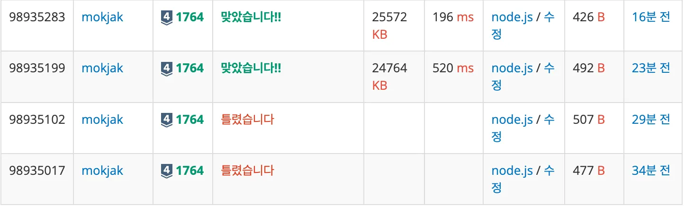

## 📝 문제 요약

> 듣도 못한 사람 N명 + 보도 못한 사람 M명 목록이 주어질 때, 두 집합의 교집합(듣보잡)을 사전순으로 출력
> 출력: 교집합 원소 수 + 사전순 정렬된 이름 목록

---

## 💡 1. 나의 접근 방식 & 핵심 아이디어

- **알고리즘/자료구조:** N명 목록은Set(멤버 검사 .has메서드로 O(1)) + 배열 정렬
- **시간/공간 복잡도:**
  - **시간**: O(N + M + KlogK ) (K = 교집합 크기)
  - **공간**: O(N + K)
- **핵심 로직:**
  1. N개 이름을 Set에 저장
  2. M개 순회하며 Set.has로 교집합 수집
  3. 결과 배열 사전순 정렬
  4. 길이와 내용 한번에 출력

---

## ✨ 2. 나의 최종 코드

- 코드 보기

  ```jsx
  const fs = require("fs");
  const input = fs.readFileSync("/dev/stdin").toString().trim().split("\n");

  const [n, m] = input[0].split(" ").map(Number);
  const heardSet = new Set(input.slice(1, n + 1));
  const resultArr = [];

  for (let i = n + 1; i <= n + m; i++) {
    const name = input[i];
    if (heardSet.has(name)) resultArr.push(name);
  }

  resultArr.sort();

  process.stdout.write(resultArr.length + "\n" + resultArr.join("\n"));
  ```

---

## 🤔 3. 문제 회고 (Retrospective)

### 🐾 3-1. 오류 해결 과정 (Troubleshooting Log)



- **1차시도(틀렸습니다)**
  - **구현**: Set에 N 저장, M 순회 후 교집합 출력
  - **발견한 오류:** 사전 순 정렬 안함!
- **2차시도(틀렸습니다)**

  - **수정:** `resultArr.sort((a, b) => a - b);` 추가
  - **발견한 오류:** 정렬이 제대로 되지 않음!.
    → `String`은 `-`을 만나 산술연산이 되며 `NaN`으로 처리되었기 때문

- **3차시도(맞았습니다!)**

  - **개선:** `resultArr.sort();` 으로 수정

- **4차시도(맞았습니다! - 리팩토링)**

  - 불필요 변수(max, new Array()) 제거
    ```jsx
    const resultArr = []; //기존: new Array();
    ```
  - Set 초기화 단축

    ```jsx
    //기존
    const heardSet = new Set();
    for (let i = 1; i <= n; i++) {
      heardSet.add(input[i]);
    }

    //수정
    const heardSet = new Set(input.slice(1, n + 1));
    ```

  - 출력 최적화
    ```jsx
    //기존: console.log 반복
    //수정:
    process.stdout.write(resultArr.length + "\n" + resultArr.join("\n"));
    ```

### **🌱 3-2. 새롭게 알게 된 점 (Learning Points)**

- `Set.has` vs `Array.includes`:

  1. `Array.includes` 사용

     찾는 시간: `O(N)`→ `O(N*M)` 시간 필요

     ⇒ 최종 시간 비용: `O(N*M + KlogK)`

  2. `Set.has` 사용

     찾는 시간: `O(1)`→ `O(M)` 시간 필요

     ⇒ 최종 시간 비용: `O(N + M + KlogK)`

- **문자열 정렬:** 기본 `sort()`는 오름차순(사전순)
  - `-` 연산 사용 시 산술연산이 되어 `NaN`이 됨.
- `localeCompare`: 다국어/대소문자 옵션 필요시 사용 가능
- **출력 성능:** 줄 단위 `console.log` 대신 한번에 출력 속도가 훨씬 빠름 (약 544ms → 196ms)

### 🧐 3-3. 더 궁금한 점 & 다음 목표 (Further Questions)

- localeCompare 성능
